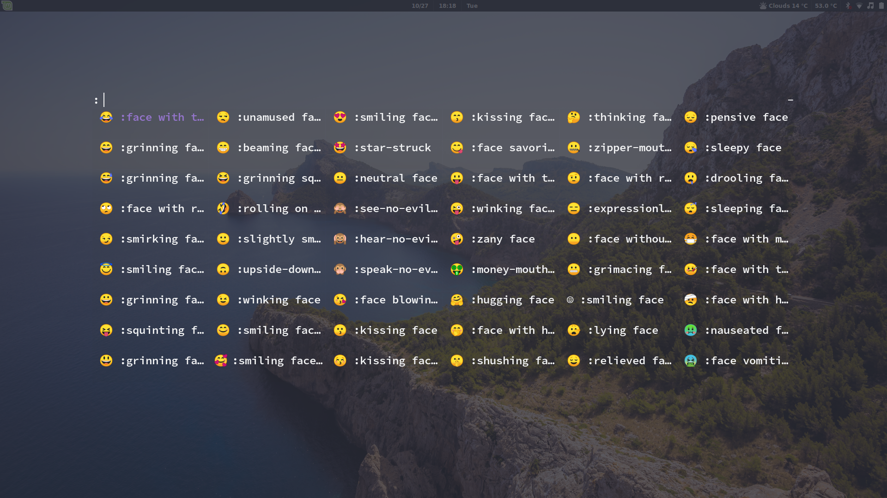

# Em🙃ji

Displays a `rofi` menu with emojis and loads the emoji into clipboard.

***Update***: now it automatically pastes the emoji

Mapped to mod+E on my keyboard.

`bash -e /home/ddmin/Code/Bash/emoji-selector`

## Files
* emoji-list goes in ~/.config/rofi/emoji-list
* emoji-selector just needs to be on $PATH

## Original Script
99% copied from this [script](https://gist.github.com/imAliAzhar/f3b16622cd279fb0b019f237a8a12510).

## Changes
I removed the pasting function because it doesn't work, and I added a notify-send command instead.

I also don't use the theme attached to this gist because [my theme](https://raw.githubusercontent.com/ddmin/dotfiles/master/dotfiles/.Xresources) will suffice.

Only downside is I had to display the names of the emojis. Might fix this.
